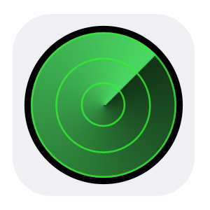

#### ioBroker.find-my-iphone 
ioBroker Adapter to find Apple devices

#### Info
First release and beta version

The adapter tries to read its own location from the adapter ioBroker.javascript. If it is not available, the location of the external IP will be determined. Otherwise 0.0+0.0 will be taken. The location is used zu calculate the distance to the device.

#### States
Use the "alert" state of each device to play a sound on that device. The text of the alert state will be shown on the device.

Use the "refresh" state in the root, to refresh all devices.

#### Installation
Execute the following command in the iobroker root directory (e.g. in /opt/iobroker)
```
npm install iobroker.find-my-iphone 
```
### License
The MIT License (MIT)

Copyright (c) 2016 soef <soef@gmx.net>

Permission is hereby granted, free of charge, to any person obtaining a copy
of this software and associated documentation files (the "Software"), to deal
in the Software without restriction, including without limitation the rights
to use, copy, modify, merge, publish, distribute, sublicense, and/or sell
copies of the Software, and to permit persons to whom the Software is
furnished to do so, subject to the following conditions:

The above copyright notice and this permission notice shall be included in
all copies or substantial portions of the Software.

THE SOFTWARE IS PROVIDED "AS IS", WITHOUT WARRANTY OF ANY KIND, EXPRESS OR
IMPLIED, INCLUDING BUT NOT LIMITED TO THE WARRANTIES OF MERCHANTABILITY,
FITNESS FOR A PARTICULAR PURPOSE AND NONINFRINGEMENT. IN NO EVENT SHALL THE
AUTHORS OR COPYRIGHT HOLDERS BE LIABLE FOR ANY CLAIM, DAMAGES OR OTHER
LIABILITY, WHETHER IN AN ACTION OF CONTRACT, TORT OR OTHERWISE, ARISING FROM,
OUT OF OR IN CONNECTION WITH THE SOFTWARE OR THE USE OR OTHER DEALINGS IN
THE SOFTWARE.
